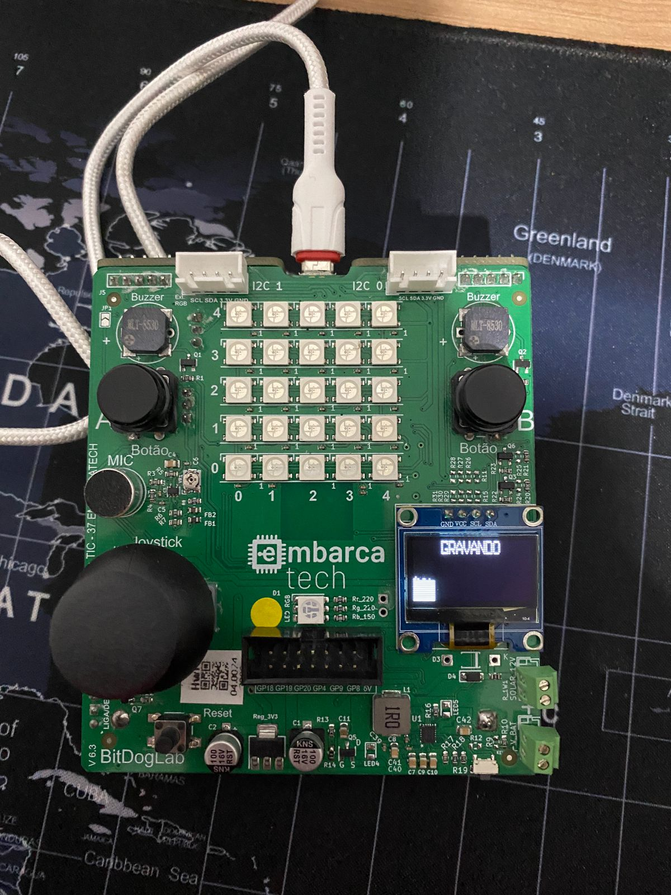

# 🚀 Sound Synth

## 🎯 Objetivo do Projeto
Este repositório apresenta o projeto de um **Sound Synth** desenvolvido para o programa de residência **EmbarcaTech 2025**. Aqui você encontrará o código-fonte, documentação e recursos utilizados no desenvolvimento do projeto.

## 📂 Estrutura do Projeto

```
/sound_synth
│── /build         # Diretório de compilação (gerado pelo CMake)
│── /src           # Código-fonte principal (.c, .cpp)
│── /include       # Cabeçalhos (.h, .hpp)
│── /lib           # Bibliotecas externas (se necessário)
│── CMakeLists.txt # Configuração do projeto CMake
│── pico_sdk_import.cmake # Importação do SDK da Raspberry Pi
│── README.md      # Documentação do projeto
```

## 🛠️ Requisitos e Configuração
Para compilar e rodar os projetos no **Raspberry Pi Pico W**, siga os passos abaixo:

1. **Instale o SDK do Pico** seguindo as instruções oficiais da Raspberry Pi.
2. Clone este repositório:
   ```bash
   git clone https://github.com/seu_usuario/seu_repositorio.git
   cd meu_projeto
   ```
3. **Crie o diretório de build e compile:**
   ```bash
   mkdir build
   cd build
   cmake ..
   make
   ```
4. **Carregue o firmware no Raspberry Pi Pico W.**

## 🖼️Imagens e vídeos


https://drive.google.com/file/d/1O5sziL2rjnO3OFda-hDp5GLKtuvsBcCq/view?usp=sharing

## 👤 Autor
**Gabriel Martins - Hbr Campinas**

Se tiver dúvidas ou sugestões, fique à vontade para contribuir ou abrir uma _issue_. 🚀
